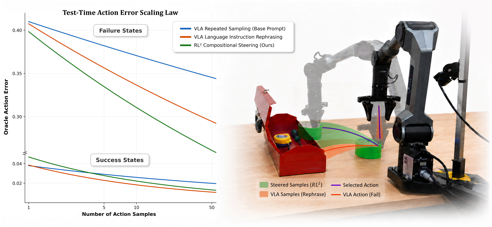
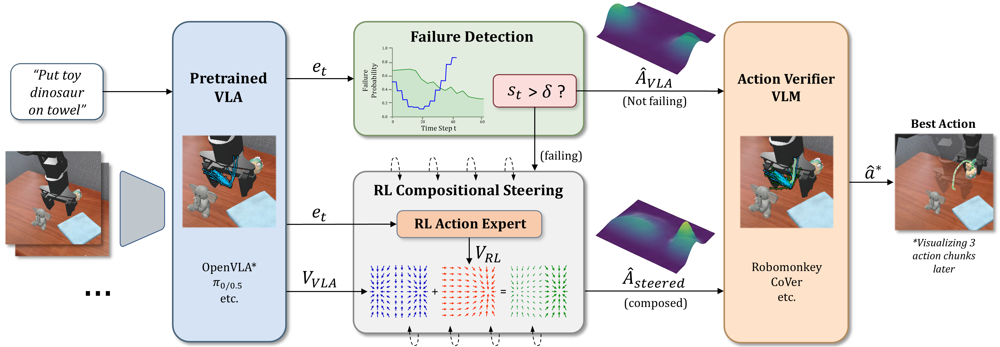

<h2 align="center">RL²-VLA: Adaptive RL Latent Compositional Steering with Test-Time Scaling for Vision-Language-Action Models</h2>
<p align="center">
  <a href="https://rl2-vla.github.io"></a>
  &emsp;&emsp;
  <a href="https://arxiv.org/abs/2607.26991"></a>
  &emsp;&emsp;
  <a href="https://huggingface.co/rl2-vla"></a>
  &emsp;&emsp;
  <a href="https://www.youtube.com/watch?v=0qdPVgib6vI"></a>
</p>

<div align="center">
  
  <br>
  RL² improves VLA test-time scaling by adaptively applying RL compositional steering when the base VLA is likely to fail, particularly
  in out-of-domain settings, without modifying the pretrained VLA.
</div>


## 📢 News / To-Dos
- [ ] Release RL²-VLA for PolaRiS simulation
- [ ] Release version optimized for inference speed
- [x] Initial release of RL²-VLA codebase for SIMPLER simulation


## 📚 Table of contents
- [Repository Setup](#setup)
- [Evaluation](#evaluation)
- [Training](#training)
- [Troubleshooting](#troubleshooting)
- [Acknowledgements](#acknowledgements)


<a id="setup"></a>
## 🛠️ Repository Setup


<!-------------------- Repo Setup -------------------->

### Code Setup

Clone the repository and submodules (i.e. `SAFE`, `QAM`) using the following:

```bash
git clone --recurse-submodules https://github.com/marmotlab/RL2-VLA.git
cd RL2-VLA/
```

Use the provided script to set up all dependencies. Please run from the **root directory**:

```bash
conda create -n rl2 python=3.10
conda activate rl2
bash RL2_CoVer_VLA/env_simpler_pi.sh
```

**Requirements:** Linux, Python 3.10, CUDA-capable GPU (e.g. H100, A6000, RTX5090).


### Download Pretrained Checkpoints

#### 1. SAFE Failure Detector ####

Provided directly in the [SAFE submodule](https://github.com/mobile-pi/SAFE/tree/dc226d4b76cccb5377dff021bd595debbe057f52/scripts/batch_training/logs/SAVED) - no download needed.
However, we strongly encourage you to [retrain the SAFE model](#training) with rollouts collected on your compute platform for better performance.


#### 2. QAM RL Steering Policy ####

```bash
cd third_party/qam/exp/SAVED/rl2-vla-qam-bridge/
huggingface-cli download rl2-vla/rl2-vla-qam-bridge rl2_vla_qam_bridge_500k.pkl flags.json --local-dir .
cd -
```

#### 3. CoVer Bridge Verifier ####

```bash
cd bridge_verifier
huggingface-cli download cover-vla/cover-vla-bridge cover_verifier_bridge.pt --local-dir .
cd ..
```


<!-------------------- Evaluation -------------------->

<a id="evaluation"></a>
## 🤖 SIMPLER Evaluation

<div align="center">
  
</div>

### Evaluation Scripts

Run evaluation for in-domain and OOD task environments. Configure the essential parameters at the top of the bash scripts as needed.

```bash
conda activate rl2

# Adaptive RL2: Steering only during failure
bash RL2_CoVer_VLA/simpler/bashes/eval_rl2_compose_adaptive.sh

# Non-adaptive RL2: Steering at all times
bash RL2_CoVer_VLA/simpler/bashes/eval_rl2_compose_always.sh

# Rephrase: Language prompt rephrasing only
bash RL2_CoVer_VLA/simpler/bashes/eval_rephrase.sh
```


### Summarize Results

After running inference, summarize success rates across seeds/tasks/methods into a table:

```bash
python RL2_CoVer_VLA/simpler/bashes/summarize_logs.py --logs_dir <PATH>
```


<!-------------------- Training -------------------->

<a id="training"></a>
## 📊 Training

### Train SAFE Failure Detector

You are strongly encouraged to retrain SAFE with rollouts collected on your compute platform.

a) **Collect rollouts** for SAFE training:

```bash
# rollout collection
bash RL2_CoVer_VLA/simpler/bashes/collect_rollouts_for_safe_training.sh  

# restructure dataset
python RL2_CoVer_VLA/simpler/bashes/restructure_rollouts_for_safe.py     
```

b) **Train the detector** using the guide in the [SAFE README](https://github.com/mobile-pi/SAFE). Thereafter, update the evaluation bash scripts with the paths to the new SAFE checkpoint, CP bands, and alpha selection heuristic json files.


### Train QAM RL Steering Policy

You may download the pretrained QAM steering policy [from above](#download-pretrained-checkpoints). Alternatively, you may follow the steps below to train your own steering policy.

a) **Augment BridgeV2 Dataset** with VLA latents
```bash
python RL2_CoVer_VLA/simpler/extract_hidden_states_and_actions.py
```

b) **Train QAM** using the guide in the [QAM README](https://github.com/mobile-pi/QAM). Thereafter, update the evaluation bash scripts with the path to the new QAM checkpoint.


## Project Structure

```
RL2-VLA/
├── RL2_CoVer_VLA/
│   ├── env_simpler_pi.sh           # Setup script
│   ├── robot_utils.py              # Utilities
│   ├── simpler/
│   │   ├── run_simpler_eval_with_openpi.py   # Eval
│   │   ├── bashes/
│   │   │   ├── eval_rl2_compose_adaptive.sh
│   │   │   ├── eval_rl2_compose_always.sh
│   │   │   └── eval_rephrase.sh
│   │   └── ...
│   └── SimplerEnv/                 # Sim Env
├── bridge_verifier/                # CoVer Verifier
├── lerobot_custom/                 # LeRobot with PI0 policy
├── third_party/
│   ├── SAFE/                       # Failure detector
│   └── qam/                        # RL steering policy
├── INT-ACT/                        # OOD Envs
├── requirements.txt
└── README.md
```

<a id="troubleshooting"></a>
## 🔎 Troubleshooting

**MuJoCo / OpenGL rendering:** If you encounter display or rendering issues, ensure:

```bash
export MUJOCO_GL=osmesa
export PYOPENGL_PLATFORM=osmesa
```

**Vulkan error:** If you see `No Vulkan extensions found for window surface creation`, you may need to install Vulkan dependencies or use `osmesa` as above.


<!-------------------- References -------------------->

<a id="acknowledgements"></a>
## ✅ Acknowledgements
This repository is adapted from [CoVer](https://cover-vla.github.io/).
Our research is also based on [RoboMonkey](https://robomonkey-vla.github.io/), [SAFE](https://vla-safe.github.io/), [SimplerEnv](https://simpler-env.github.io/), [PolaRiS](https://polaris-evals.github.io/), and other related works.
We would like to thank the authors for their great work. Please refer to their papers for more details.

If you intend to use our work in your research, please cite the following publication:
```bibtex
@article{tan2026rl2,
  title={RL$^2$-VLA: Adaptive RL Latent Compositional Steering with Test-Time Scaling for Vision-Language-Action Models}, 
  author={Derek Ming Siang Tan and Shailesh Shailesh and Srikrishna Iyer and William Wei Jie Teo and Yuanliang Ju and Qiao Gu and Guillaume Sartoretti},
  year={2026},
  journal={arXiv preprint arXiv:2607.26991}, 
}
```
